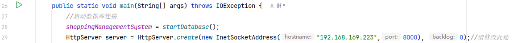
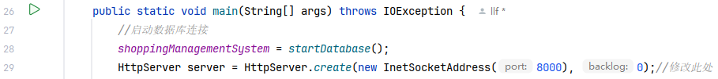
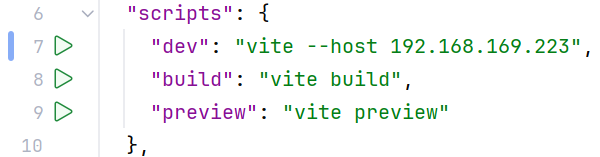
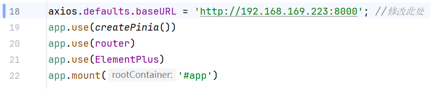

# Shopping Price System 项目运行说明

## 项目概述
该项目是一个商品比价网站，包含前端和后端部分。
- **后端**：使用 Java 编写，运行在 `src` 目录。
- **前端**：使用 Vue.js 编写，运行在 `frontend` 目录。
- **数据库**：使用 MySQL 中的数据库`shopping`。

目前代码直接运行，网站运行在`localhost`上面。

如果想要通过网址访问(或实现手机端访问)，请按照运行步骤中`Ipv4部署`做出相应的修改。

## 运行步骤
### 0. 初始化数据库
请检查您的 MySQL 中无数据库`shopping`，或该数据库内无重要数据。

在`/src/main/source`目录下按`build.sql`和`init.sql`的顺序初始化数据库。

    其中，'init.sql'中需要您在插入用户表和降价提醒表时，修改为自己的邮箱号以接收降价提醒。
    
    当然，您可以忽略插入到用户表的数据内容，通过"用户注册"功能来实现账户注册。
    但是降价提醒表需要提前插入一条数据，且邮箱号为您正在使用的邮箱号。

    因为本商品比价网站记录真实商品的实时价格，编写代码时设计的逻辑是只有商品价格更新时才会写入历史价格表。
    而"降价提醒"功能的基准价格为设置降价提醒时的商品价格。短期内商品价格可能很难发生变化，这使得降价提醒功能难以检验。
    为了方便检验"降价提醒"功能，需要提前插入一条高价的降价提醒记录。

    在'init.sql'中已经为您提前准备了一条降价提醒数据，对应的搜索关键词为'女装',电商平台名为'淘宝',具体商品描述为'高腰百搭羊羔绒阔腿裤冬季保暖'。
    价格为50元，搜索展示是按价格升序实现的，可能需要麻烦您找一下。

    同样原因，"历史价格查询"功能的检查也需要提前插入历史价格数据，在'init.sql'中为您准备的商品与降价提醒的商品相同。

    所有功能均不会限制您的搜索关键词，只是出于方便检验考虑。


### 1. 运行后端
#### 修改监听网址
① 如果使用Ipv4部署,请把`hostname`修改为您的Ipv4地址。



② 如果选择`localhost`部署，请这样配置。



在 IntelliJ IDEA 中按下`Ctrl`+`F5`或`运行'Main'`运行后端 
### 2. 运行前端
#### 1. 修改前端网址
修改`/frontend/src/package.json`中的`dev`，有两种部署方式：



① 将其更换为您的Ipv4地址运行。

    建议电脑连接手机热点，不要使用校网这种加密网络，家中路由器缺乏条件未测试。
    一定要关闭"防火墙和网络保护"中的"专用网络"保护，防止手机发送给后端的数据包被阻拦。
    同热点的所有设备如手机等，均可通过"网址+端口号(5173)"的方式访问该网站。

② 删除`vite`之后的所有内容改为本地运行。

    只能在运行前后端的电脑通过"localhost:5173"访问该网站。

#### 2. 修改后端接受网址
同样地，在`frontend/src/main.js`中修改后端接受网址(手机Ipv4或者localhost)，使其和[1. 修改前端网址](#1-修改前端网址)相同。




#### 3. 使用bash运行前端
在根目录下使用 bash 运行前端
   ```bash
   cd frontend; npm install; npm run dev;
   ````
### 3. 使用网站
访问部署的网址+端口号，开始使用网站。

    "获取商品信息"功能是通过申请官方电商平台的API实现的。
    若API过期，搜索商品时会有对应的提醒，经测试也有可能是API一方出错。
    若多次尝试，均显示"API过期",麻烦您联系3220105251(邮箱或者钉钉均可)，我再申请一下API。